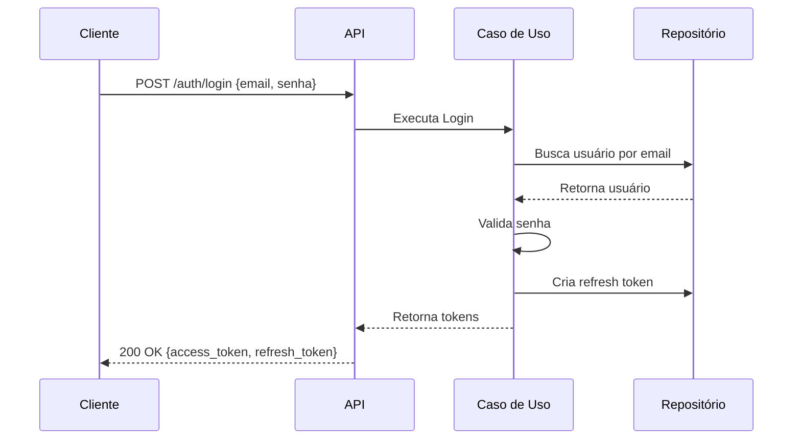
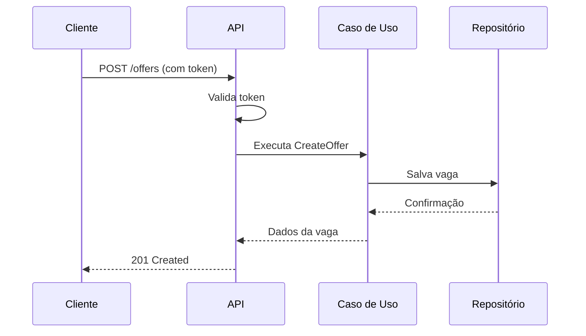
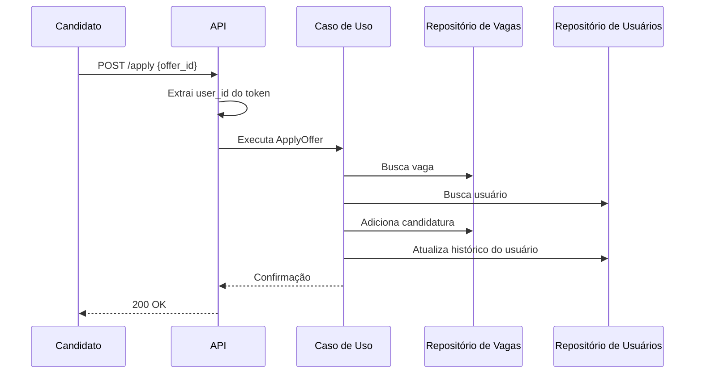

# Documentação do Sistema EventoJob

## Índice
1. [Visão Geral](#visão-geral)
2. [Arquitetura do Sistema](#arquitetura-do-sistema)
3. [Fluxo de Dados](#fluxo-de-dados)
4. [Guia do Desenvolvedor](#guia-do-desenvolvedor)
5. [Guia de Implantação](#guia-de-implantação)
6. [Segurança](#segurança)
7. [Referência da API](#referência-da-api)
8. [FAQ](#faq)

## Visão Geral

O EventoJob é uma plataforma de recrutamento online que conecta candidatos a vagas de emprego. O sistema foi desenvolvido seguindo os princípios da Clean Architecture, garantindo separação de responsabilidades e facilidade de manutenção.

### Principais Funcionalidades
- Cadastro e autenticação de usuários
- Publicação de vagas de emprego
- Candidatura a vagas
- Gestão de perfis profissionais
- Sistema de autenticação seguro com JWT

### Tecnologias Principais
- **Backend**: Python 3.10+
- **Framework Web**: FastAPI
- **Banco de Dados**: MongoDB
- **Autenticação**: JWT + Refresh Tokens
- **Hash de Senhas**: Argon2
- **Testes**: pytest (recomendado)

## Arquitetura do Sistema

### Estrutura de Diretórios
```
src/
├── application/      # Casos de uso e portas
├── domain/          # Entidades e regras de negócio
├── interfaces/      # Controladores HTTP e schemas
└── core/
    └── infrastructure/
         └── db/  # Configurações do banco de dados
└── infrastructure/  # Implementações concretas
```

### Camadas da Aplicação

1. **Domínio**
   - Contém as regras de negócio centrais
   - Entidades imutáveis e value objects
   - Independente de frameworks e bibliotecas externas

2. **Aplicação**
   - Implementa os casos de uso do sistema
   - Define interfaces (portas) para serviços externos
   - Orquestra o fluxo de dados entre as camadas

3. **Infraestrutura**
   - Implementações concretas das portas definidas na camada de aplicação
   - Acesso a banco de dados, serviços externos, etc.
   - Configurações do sistema

4. **Interfaces**
   - Controladores HTTP (FastAPI)
   - Schemas de validação de entrada/saída
   - Documentação da API

## Fluxo de Dados

### 1. Autenticação


### 2. Publicação de Vaga


### 3. Candidatura a Vaga


## Guia do Desenvolvedor

### Configuração do Ambiente

1. **Pré-requisitos**
   - Python 3.10+
   - MongoDB 5.0+
   - Git

2. **Configuração Inicial**
   ```bash
   # Clonar repositório
   git clone [url-do-repositorio]
   cd EventoJob
   
   # Criar ambiente virtual
   python -m venv .venv
   source .venv/bin/activate  # Linux/Mac
   # ou
   .venv\Scripts\activate    # Windows
   
   # Instalar dependências
   pip install -r requirements.txt
   
   # Configurar variáveis de ambiente
   cp .env.example .env
   # Editar .env com suas configurações
   ```

3. **Executando a Aplicação**
   ```bash
   # Iniciar servidor de desenvolvimento
   uvicorn src.main:app --reload
   ```

### Estrutura de Código

#### Domínio
- `entities.py`: Define as entidades principais (User, Offer, etc.)
- `value_objects.py`: Objetos de valor (Email, PasswordHash, etc.)
- `exceptions.py`: Exceções de domínio

#### Aplicação
- `ports/`: Interfaces para serviços externos
- `use_cases/`: Implementações dos casos de uso

#### Infraestrutura
- `repositories/`: Implementações dos repositórios
- `services/`: Serviços externos (email, storage, etc.)

#### Interfaces
- `schemas/`: Schemas Pydantic para validação
- `routers/`: Rotas da API
- `middleware/`: Middlewares personalizados

### Testes

```bash
# Executar testes
pytest tests/

# Com cobertura de código
pytest --cov=src tests/
```

## Guia de Implantação

### Requisitos de Produção
- Servidor Linux (Ubuntu 20.04+ recomendado)
- MongoDB 5.0+
- Python 3.10+
- Nginx (opcional, para produção)

### Passos para Implantação

1. **Preparação do Servidor**
   ```bash
   # Atualizar sistema
   sudo apt update && sudo apt upgrade -y
   
   # Instalar dependências
   sudo apt install -y python3-pip python3-venv nginx
   
   # Instalar MongoDB
   wget -qO - https://www.mongodb.org/static/pgp/server-5.0.asc | sudo apt-key add -
   echo "deb [ arch=amd64,arm64 ] https://repo.mongodb.org/apt/ubuntu focal/mongodb-org/5.0 multiverse" | sudo tee /etc/apt/sources.list.d/mongodb-org-5.0.list
   sudo apt update
   sudo apt install -y mongodb-org
   sudo systemctl start mongod
   sudo systemctl enable mongod
   ```

2. **Configuração da Aplicação**
   ```bash
   # Criar usuário para a aplicação
   sudo useradd -m -d /opt/EventoJob EventoJob
   sudo -u EventoJob bash -c 'cd /opt/EventoJob && python3 -m venv .venv'
   
   # Copiar código
   sudo -u EventoJob bash -c 'git clone [url-do-repositorio] /opt/EventoJob/src'
   
   # Instalar dependências
   sudo -u EventoJob bash -c 'cd /opt/EventoJob/src && ../.venv/bin/pip install -r requirements.txt'
   
   # Configurar arquivo .env
   sudo -u EventoJob cp /opt/EventoJob/src/.env.example /opt/EventoJob/src/.env
   # Editar com as configurações de produção
   ```

3. **Configuração do Systemd**
   ```ini
   # /etc/systemd/system/EventoJob.service
   [Unit]
   Description=EventoJob API
   After=network.target
   
   [Service]
   User=EventoJob
   WorkingDirectory=/opt/EventoJob/src
   Environment=PATH=/opt/EventoJob/.venv/bin:$PATH
   ExecStart=/opt/EventoJob/.venv/bin/uvicorn src.main:app --host 0.0.0.0 --port 8000
   Restart=always
   
   [Install]
   WantedBy=multi-user.target
   ```

4. **Configuração do Nginx (opcional)**
   ```nginx
   server {
       listen 80;
       server_name seu-dominio.com;
       
       location / {
           proxy_pass http://localhost:8000;
           proxy_set_header Host $host;
           proxy_set_header X-Real-IP $remote_addr;
           proxy_set_header X-Forwarded-For $proxy_add_x_forwarded_for;
           proxy_set_header X-Forwarded-Proto $scheme;
       }
   }
   ```

5. **Iniciar Serviços**
   ```bash
   sudo systemctl daemon-reload
   sudo systemctl enable EventoJob
   sudo systemctl start EventoJob
   sudo systemctl restart nginx
   ```

## Segurança

### Autenticação e Autorização
- Tokens JWT com tempo de vida curto (30 minutos)
- Refresh tokens com tempo de vida maior (7 dias)
- Validação de escopo de acesso
- Proteção contra CSRF

### Armazenamento de Senhas
- Uso de Argon2 para hashing de senhas
- Salt único por usuário
- Fatores de custo configuráveis

### Boas Práticas
- Validação de entrada em todas as camadas
- Logging de operações sensíveis
- Rate limiting em endpoints públicos
- Headers de segurança HTTP

## Referência da API

### Autenticação

#### Login
```
POST /v1/auth/login
```
**Request:**
```json
{
  "email": "usuario@exemplo.com",
  "password": "senha123"
}
```

**Response (200 OK):**
```json
{
  "access_token": "eyJhbGciOiJIUzI1NiIsInR5cCI6IkpXVCJ9...",
  "refresh_token": "550e8400-e29b-41d4-a716-446655440000",
  "token_type": "bearer",
  "expires_in": 1800
}
```

### Usuários

#### Criar Usuário
```
POST /v1/users
```
**Request:**
```json
{
  "email": "novo@usuario.com",
  "password": "Senha@123"
}
```

**Response (201 Created):**
```json
{
  "id": "123e4567-e89b-12d3-a456-426614174000",
  "email": "novo@usuario.com",
  "status": "active",
  "created_at": "2023-01-01T12:00:00Z"
}
```

### Vagas

#### Listar Vagas
```
GET /v1/offers?page=1&limit=10
```

**Response (200 OK):**
```json
{
  "items": [
    {
      "id": "550e8400-e29b-41d4-a716-446655440000",
      "title": "Desenvolvedor Python",
      "location": "Remoto",
      "salary": 10000,
      "requirements": "Python, FastAPI, MongoDB",
      "description": "Vaga para desenvolvedor backend...",
      "status": "active",
      "created_at": "2023-01-01T12:00:00Z"
    }
  ],
  "total": 1,
  "page": 1,
  "pages": 1
}
```

## FAQ

### Como resetar uma senha?
Atualmente, o sistema não possui um fluxo de recuperação de senha implementado. Entre em contato com o suporte para ajuda.

### Posso ter mais de um cargo por empresa?
Sim, você pode publicar quantas vagas forem necessárias. Cada vaga é independente.

### Como faço para atualizar meus dados?
Envie uma requisição PATCH para `/v1/users/me` com os campos que deseja atualizar.

### Quais são os requisitos mínimos para o servidor?
- 1 vCPU
- 2GB RAM
- 10GB de armazenamento
- Ubuntu 20.04+

### Como reportar um bug?
Abra uma issue no repositório do projeto ou entre em contato com nossa equipe de suporte.

---

Documentação atualizada em: 20/09/2023  
Versão: 1.0.0
